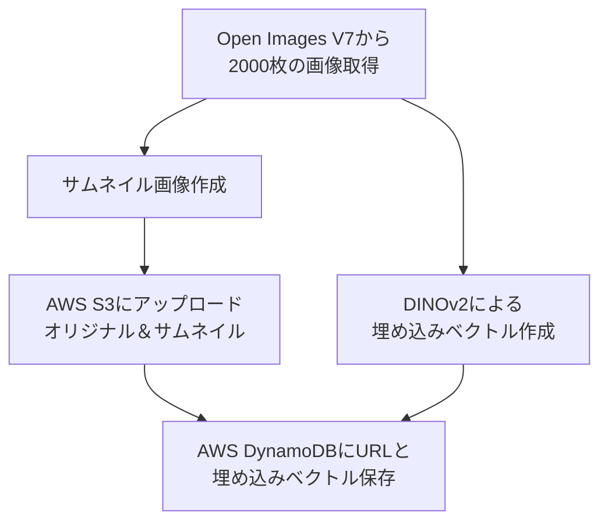
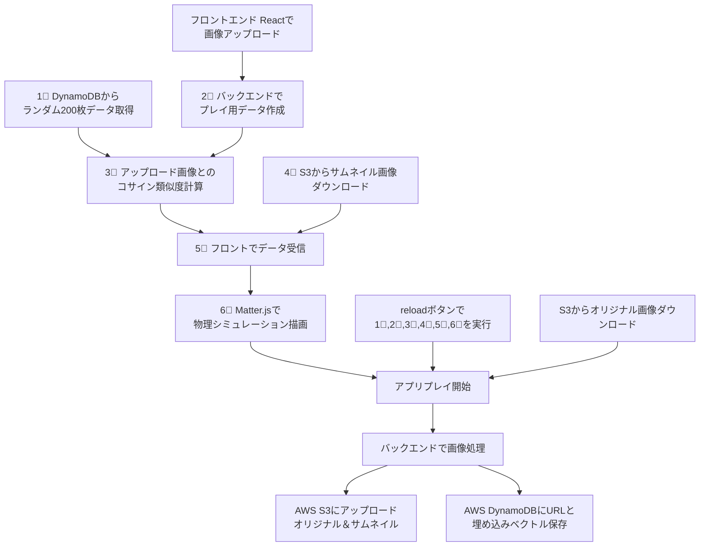

# similar_image_project

## Overview
本プロジェクトは、類似画像検索Webアプリケーションです。  
[similar_image_project アプリ](http://simila-publi-q1g1koutz9vw-1613792410.ap-northeast-1.elb.amazonaws.com/)
##
**主な処理の流れは以下の通りです。**

1. **事前処理**  
   - Open Images V7からランダムに取得した2000枚の画像に対し、**DINOv2** を用いて埋め込みベクトルを作成。
   - 同時に画像のサムネイル（小さい画像）を生成。
   - オリジナル画像とサムネイルはAWS S3にアップロード。
   - 生成した埋め込みベクトルとS3上の画像URLをAWS DynamoDBに保存。

2. **検索処理**  
   - フロントエンド（React）で画像をアップロードすると、バックエンドでプレイ用のサムネイルと埋め込みベクトルが作成される。
   - DynamoDBからランダムに200枚分のデータを選出し、アップロード画像とのコサイン類似度を計算。
   - 画像URLと類似度の情報をフロントに送信。

3. **表示とプレイ**  
   - フロントでは、送信されたURLをもとにS3からサムネイル画像をダウンロード。
   - Matter.jsを用いて、類似度に応じた物理特性（引力・斥力）を付与したサムネイルを描画し、簡単なアプリとしてプレイ可能にします。

4. **デプロイ**  
   - AWS Copilotを使用し、バックエンドサービスと連携するS3バケット、DynamoDBテーブルを自動で作成・管理しています。
  
5. **使用技術**
   - `similar_image_project.ipynb`に使用技術の解説をまとめました。

---

   ## 処理の流れ（事前準備）

## 処理の流れ（アプリ）

